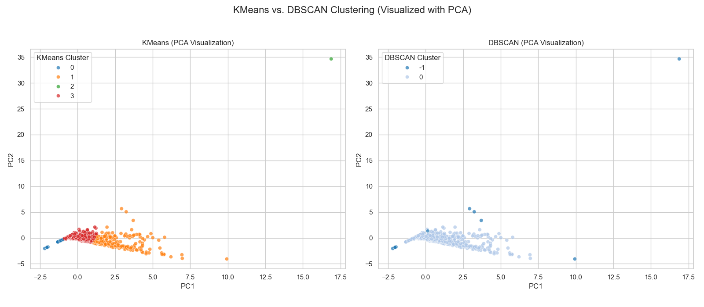
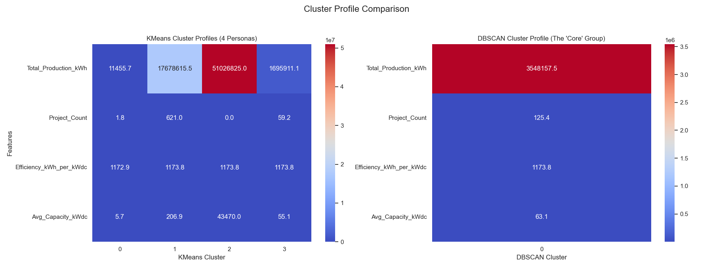

# Clustering Solar Energy Production Zones

Unsupervised learning project that groups ZIP-code zones by solar production, capacity and project count to find distinct market segments. Built as part of a data science On Job Training program, using a public dataset.

**Shubham Adate** | [LinkedIn](https://www.linkedin.com/in/adate-shubham) | [GitHub](https://github.com/shubhamadatework-git)

## Problem
Instead of looking at individual solar projects, group similar zones to see where solar is saturated, where large projects dominate and where output is highest.

## Data
- 218,115 solar project records (13 columns after dropping redundant ones; system size in kWdc and kWac were about 99.9% correlated)
- Aggregated to **1,730 ZIP-code zones** with zone-level features such as total production, total capacity and project count
- Source: [Statewide Distributed Solar Projects (NY Open Data)](https://data.ny.gov/d/wgsj-jt5f). See `data/README.md`.

## Approach
1. Exploratory analysis (skewed distributions, missing data, bivariate relationships)
2. Cleaning, feature engineering and aggregation by ZIP code
3. K-Means clustering, with k chosen using the elbow method and silhouette scores (k = 4)
4. DBSCAN for comparison, with epsilon chosen from a k-distance plot
5. PCA and t-SNE visualisations and cluster-profile heatmaps

## Results
K-Means produced four zone types:

| Cluster | Profile |
|---|---|
| 0 | Small-scale, mostly residential |
| 1 | High density: many small projects (saturated markets) |
| 2 | High efficiency: strong output per project |
| 3 | Large-scale: a few very large commercial or industrial projects |

DBSCAN found one dense core group and treated the unusual zones as noise, so K-Means gave the more useful segmentation here.




## Business use
- Different go-to-market approaches by zone type (upgrades and storage in saturated areas, commercial sales in large-scale areas)
- Benchmarks from high-output zones when proposing new projects

## Limitations
- The clusters are descriptive. They show patterns, not causes.
- Zone-level aggregation hides differences between individual projects

## Run it
```bash
pip install -r requirements.txt
jupyter notebook solar-production-zone-clustering.ipynb
```

**Tech:** Python, pandas, NumPy, scikit-learn, seaborn, matplotlib
